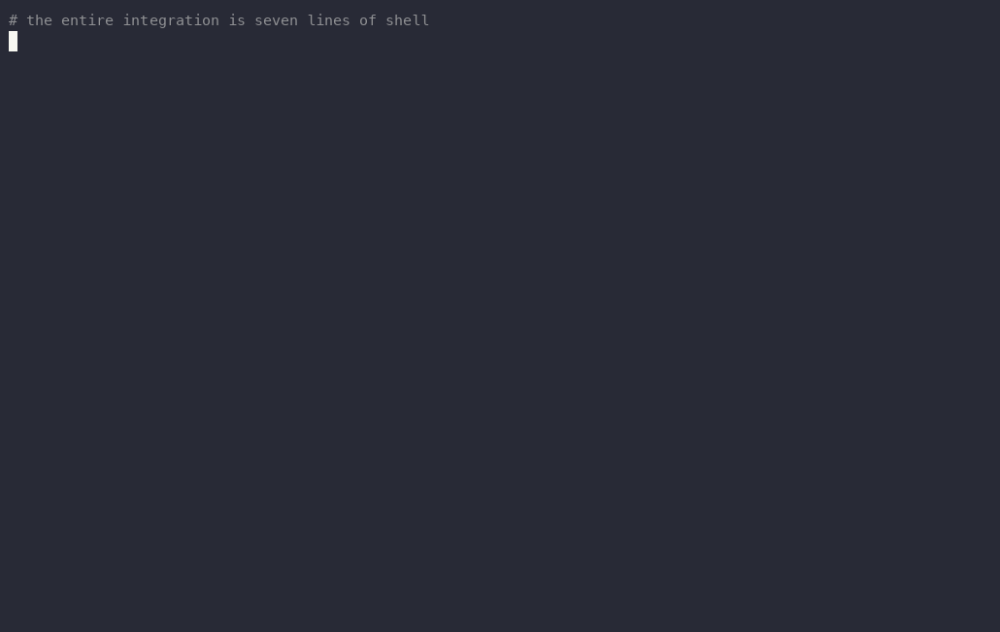

# chainsaw

**Blocks typosquatted and known-malicious packages at install time — offline, on
your machine, with no account and no daemon.**

[](LICENSE)
[](https://pkg.go.dev/github.com/chain305/chainsaw-core)
[](go.mod)



<sub>Real session, real binary — only the keystroke timing is simulated. The
script is [`assets/record-demo.sh`](assets/record-demo.sh) and the raw cast is
[`assets/chainsaw-demo.cast`](assets/chainsaw-demo.cast), so you can replay or
re-record it yourself.</sub>

The block, as text:

```console
$ npm install expresss
chainsaw  ✗ blocked  npm:expresss — looks like a typosquat of "express" (distance 1, edit-distance, target rank #262)
chainsaw  if you have verified this package is real: chainsaw guard allow npm:expresss
chainsaw  ✗ refused at the install path — nothing was installed
```

Exit code `1`. Nothing was fetched, nothing was executed, nothing left the
machine. You typed `npm` — a shell function routed it through the guard first.
That verdict came from name analysis alone: no feed, no lookup, and no prior
sighting of `expresss` by anyone.

<details>
<summary>The same run, untrimmed — it is noisier than the excerpt above</summary>

Chainsaw states on every run which checks did *not* run. This is a fresh install
with no feed downloaded yet:

```console
$ npm install expresss
chainsaw  offline known-malicious + typosquat active; run `chainsaw guard update` for the full OpenSSF malicious-package set
chainsaw  behavioral byte scan not run; using name/feed/typosquat checks only (set CHAINSAW_GUARD_DEEP=1 or stage artifacts for byte-level coverage)
chainsaw  ✗ blocked  npm:expresss — looks like a typosquat of "express" (distance 1, edit-distance, target rank #262)
chainsaw  if you have verified this package is real: chainsaw guard allow npm:expresss
chainsaw  ✗ refused at the install path — nothing was installed
```

An interactive terminal adds two more lines the first time around: a one-off
telemetry notice ([Telemetry](#telemetry)) and, once you are past the first few
blocks, an occasional prompt to sign up. Neither appears in CI.

</details>

**This repository is the open core of [Chainsaw](https://chain305.com)**: the
CLI, the install-time guard, the detection engines, the policy proxy, and the
ecosystem parsers — all Apache-2.0, all standalone. No license check, no plan
gate, no phone-home. A separate commercial control plane builds on top of it;
[everything about that split is spelled out below](#open-core).

---

## Contents

**Use it** — [Quickstart](#quickstart) · [How it works](#how-it-works) · [What
gets checked](#what-gets-checked) · [CI](#ci) · [CLI reference](#cli-reference)
· [Configuration](#configuration)

**Evaluate it** — [Scope and limits](#scope-and-limits) · [Measured
performance](#measured-performance) · [False
positives](#false-positives-and-the-escape-hatch) · [How it
compares](#how-it-compares)

**Build on it** — [Go libraries](#go-libraries) · [Open core](#open-core) ·
[Telemetry](#telemetry) · [Security](#security)

---

## Quickstart

```sh
curl -fsSL https://chain305.com/install.sh | sh
```

<details>
<summary>Other install methods</summary>

```sh
# Go toolchain
go install github.com/chain305/chainsaw-core/cmd/chainsaw@latest

# From source
git clone https://github.com/Chain305/chainsaw-core && cd chainsaw-core
go build ./cmd/chainsaw
```

Prebuilt binaries: macOS, Linux and Windows on `amd64` and `arm64`, statically
linked (`CGO_ENABLED=0`).

</details>

Wire it into your shell — one command, idempotent, safe to re-run:

```sh
chainsaw guard init --install
```

That appends a single `eval` line to your shell rc file. Use `--dry-run` to see
the exact file and line first, or skip it entirely and put
`eval "$(chainsaw guard init zsh)"` in your rc yourself. `bash`, `zsh` and
`fish` are supported.

Then just use your package manager normally:

```sh
npm install expresss         # typosquat — refused
npm ci                       # every package in the resolved lockfile
pip install -r req.txt       # every pinned requirement
chainsaw why npm expresss    # explain any verdict
chainsaw doctor              # read-only: what's wired, what isn't
```

### First run in a real terminal

After your first block you get two prompts. **Both default to Yes, so a blind
Enter accepts them.** Saying no to either costs you nothing — the offline
typosquat check is unaffected.

| Prompt | What it does |
|---|---|
| *Download the full OpenSSF malicious-package feed?* | ~40MB from GitHub, replaces the 11-entry embedded floor with ~231k entries. Takes a minute or two. Same as running `chainsaw guard update`. |
| *Share detection signals?* | Turns on telemetry — see [Telemetry](#telemetry) for exactly what that sends. |

`export CHAINSAW_OFFLINE=1` skips both. **Neither prompt ever appears in a
non-interactive shell**, so CI never fetches and never sends.

---

## How it works

There is no daemon, no background process, and no network call on the default
path. `guard init` prints seven lines of shell:

```console
$ chainsaw guard init zsh
# chainsaw install guard — https://chain305.com
npm() { command chainsaw npm "$@"; }
pip() { command chainsaw pip "$@"; }
pip3() { command chainsaw pip "$@"; }
go() { command chainsaw go "$@"; }
cargo() { command chainsaw cargo "$@"; }
gem() { command chainsaw gem "$@"; }
```

That is the entire integration. It is recursion-safe by construction: chainsaw
resolves the real `npm` through `exec.LookPath`, and a shell function cannot
shadow a PATH lookup — so `npm` (function) → `chainsaw npm` → real `npm` binary.

```
  you type: npm install expresss
        │
        ▼
  shell function ──► chainsaw npm install expresss
                            │
                            ├─ 1. parse the verb + coordinates      (no network)
                            ├─ 2. known-malicious index             (no network)
                            ├─ 3. typosquat detector                (no network)
                            ├─ 4. local allowlist                   (no network)
                            │
                     ┌──────┴──────┐
                  clear          blocked
                     │              │
                     ▼              ▼
              exec real npm    exit 1, nothing installed
```

**The known-malicious index.** 11 curated historic incidents are compiled into
the binary as a floor (`event-stream`/`flatmap-stream`, `ua-parser-js`, and
similar). `chainsaw guard update` replaces that floor with the full OpenSSF
malicious-packages set (~231k entries), cached on disk and read offline
thereafter. The feed comes from
[OpenSSF's repository](https://github.com/ossf/malicious-packages), not from us.

**The typosquat detector.** Four independent methods run against an embedded
popularity corpus — no feed, no network, and crucially no prior sighting of the
attacking name. A brand-new typosquat is on nobody's blocklist; it is still one
edit away from `lodash`.

| Method | Catches |
|---|---|
| `edit-distance` | `lodahs` → `lodash`, `requsts` → `requests` |
| `homoglyph` | Unicode lookalikes and confusables in the name |
| `combosquat` | A popular name embedded in a longer one — `lodashn`, `pydantics` |
| `reorder` | Transposed name segments |

Corpus depth differs by ecosystem, and it matters — **npm and PyPI are deep,
the rest are shallow**:

| Ecosystem | Embedded corpus |
|---|---|
| npm | 5,000 names |
| PyPI | 3,000 names |
| Go | 244 modules |
| Cargo | 177 crates |
| RubyGems | 158 gems |

Corpus membership grants an exact-match exemption, so it is a trust decision. It
rides reviewed data — a seed PR in this repo, or a Sigstore-verified bundle —
never a live per-client fetch, whose ranking would be attacker-gameable.

**State on disk.** Three locations, all inspectable, all yours:

| What | Where |
|---|---|
| Config, allowlist | `~/.config/chainsaw/` (Linux, honors `XDG_CONFIG_HOME`) · `%APPDATA%\Chainsaw\` (Windows) · `~/.chainsaw/` (macOS) |
| Local allowlist | `<config>/guard_allowlist.json` |
| Cached malicious feed | `<user cache dir>/chainsaw/known_malicious.json` |

Override with `CHAINSAW_CONFIG_HOME` and `CHAINSAW_GUARD_DB`.

---

## What gets checked

**Guarded verbs.** `npm install|i|add|ci`, `pip install`, `cargo install|add`,
`gem install`, `go get`, `go mod download`. Every other invocation delegates
straight to the real tool, untouched.

| You run | Chainsaw evaluates |
|---|---|
| `npm install <name>` | that coordinate only — **not** its dependency tree |
| `npm install` / `npm ci` | every package in the resolved lockfile |
| `pip install -r req.txt` | every pinned requirement |
| `go mod download` | everything in `go.sum` |

The verb is located defensively: a chainsaw flag can never swallow an install
verb as its value and silently downgrade the command to an unscanned passthrough
— that path fails closed and is covered by tests.

---

## CI

A GitHub Action ships from this repository. It diffs the dependencies a PR adds
or upgrades and comments on the PR; flip `mode: block` and wire it as a required
status check when you're ready to enforce.

```yaml
# .github/workflows/chainsaw.yml
name: Chainsaw Guard
on:
  pull_request:
    branches: [main]

permissions:
  contents: read
  pull-requests: write

jobs:
  chainsaw-preflight:
    runs-on: ubuntu-latest
    steps:
      - uses: actions/checkout@v4
        with:
          fetch-depth: 0        # required: pr-scan needs the base commit to diff against

      - uses: Chain305/chainsaw-core/enforcement/github-actions@action-v1
        with:
          mode: warn            # warn | block
          scan-repo: true
```

`pr-scan` exit codes, so you can gate on exactly what you mean:

| Code | Meaning |
|---|---|
| `0` | clean |
| `10` | a dependency was added or upgraded (fires on most PRs — opt in deliberately) |
| `20` | a blocking finding |
| `30` | a manifest failed to parse |

Full inputs: [`enforcement/github-actions/action.yml`](enforcement/github-actions/action.yml).

---

## CLI reference

49 commands. `chainsaw <command> --help` for flags on any of them. Commands
marked **local** need no account and no server; the rest are clients for a
Chainsaw control plane and say so if none is configured.

**Guard (install-time)** — all local

| Command | |
|---|---|
| `npm` `pip` `go` `cargo` `gem` | Run the package manager through the guard |
| `guard init` | Print (or `--install`) the shell functions that do that automatically |
| `guard update` | Fetch the full known-malicious set for offline use |
| `guard allow` | Clear a false typosquat block, locally and permanently |
| `guard status` | Local guard activity, privacy state, account sync |
| `install-hook` / `uninstall-hook` | Wire chainsaw into a package manager's own config, or remove it |
| `cargo-credentials` | Cargo credential-provider helper |

**Target & scan**

| Command | |
|---|---|
| `why` | **local** — explain why a package install was blocked |
| `pr-scan` | **local** — diff manifests, flag added or upgraded dependencies |
| `scan-repo` | **local** — scan a repo tree for chainsaw-bypass config files |
| `scan-actions` | **local** — scan GitHub Actions workflows for supply-chain risk |
| `sbom` | **local** for `diff`; `export` is server-backed |
| `scan` | Scan packages for vulnerabilities |
| `scan-remote` | Upload one lockfile, stream the aggregated report |

**Policy & enforcement**

| Command | |
|---|---|
| `policy` | Manage release policies (create, simulate, flip-to-block, import/export) |
| `admission` | K8s admission webhook helpers |
| `risk-weights` | Show, preview and apply per-signal risk-weight overrides |

**Intelligence**

| Command | |
|---|---|
| `intel` | Query the v1 risk-intelligence API |
| `pkg` | Package discovery and inspection |
| `deps` | Dependency commands |
| `affected` | Which repos, clients and SBOMs contain a package or CVE |
| `verify` | Verify a package's provenance attestation chain |

**Audit & findings**

| Command | |
|---|---|
| `finding` | Triage lifecycle: ack / snooze / resolve / suppress / reopen |
| `exception` | Scoped allow-rules with expiry |
| `audit` | Audit event commands |
| `report` | Cross-org reports derived from install events |

**Config & auth**

| Command | |
|---|---|
| `setup` | Interactive first-time wizard |
| `auth` | Log in / out (`--device` for headless, CI and agents) |
| `introduce` | **local** — the mental models, personas and vocabulary every surface shares |
| `onboard` · `onboarding` | Record and inspect onboarding state |
| `bundle` | **local** — manage and verify the offline intelligence bundle |
| `org` · `repo` · `team` · `token` · `codeowners` · `status` · `undo` | Control-plane management |

**Debug & diagnostics**

| Command | |
|---|---|
| `doctor` | **local** — diagnose package-manager wiring and install health |
| `features` | **local** — edition capabilities and server entitlements |
| `coverage` | **local** — inspect install-coverage measurements |
| `telemetry` | **local** — inspect or control local analytics |
| `version` · `completion` · `logs` | |

**Global flags** — `--json` / `--format` · `-o, --output` · `-q, --quiet` ·
`-v, --verbose` · `--no-color` · `--server` · `--token`

`--quiet` suppresses chatter only. Results and block reasons are always emitted.

---

## Configuration

Every guard-relevant environment variable:

| Variable | Effect |
|---|---|
| `CHAINSAW_OFFLINE=1` | Never touch the network. Suppresses both first-run prompts. |
| `CHAINSAW_CONFIG_HOME` | Override the config directory (CI, Nix, portable installs). |
| `CHAINSAW_GUARD_DB` | Override the cached known-malicious feed path. |
| `CHAINSAW_GUARD_DEEP=1` | Enable byte-level analysis by fetching archives. **Waives the offline guarantee.** npm and cargo, pinned versions only. |
| `CHAINSAW_GUARD_ARTIFACT_DIR` | Byte-level analysis over archives *you* stage. Stays offline. |
| `CHAINSAW_COVERAGE_MODE` | `off` (default) · `warn` · `closed` — see below. |
| `CHAINSAW_COVERAGE_REQUIRED` | Comma-separated data sources that must be evaluable. |
| `CHAINSAW_TELEMETRY_DISABLED=1` | Force telemetry off regardless of local state. |
| `CHAINSAW_QUIET` / `CHAINSAW_VERBOSE` | Output level, same as `-q` / `-v`. |
| `CHAINSAW_SERVER` / `CHAINSAW_TOKEN` | Control-plane URL and credentials. |

### Refusing when a signal cannot be evaluated

Fail-open is right for a workstation and wrong for some regulated and air-gapped
deployments. An opt-in, off-by-default gate lets you name the data sources that
must be evaluable, and refuse when one is not:

```sh
export CHAINSAW_COVERAGE_MODE=warn          # off (default) | warn | closed
export CHAINSAW_COVERAGE_REQUIRED=typosquat,malware
```

Start in `warn` — it reports what `closed` would have refused, and refuses
nothing. `typosquat` always works offline; `malware` needs `guard update`; `cve`,
`registry_metadata` and `provenance` need the server and are **never** available
offline. Requiring one the guard cannot see refuses every install, with a
readable reason. That is intended, not a bug.

---

## Scope and limits

Read this before you decide whether it is useful to you. Being wrong about scope
is worse than being narrow.

**`npx` and `npm exec` are not covered.** The download-and-execute path is not
guarded today.

**It is bypassable, on purpose.** The shell hook wraps your package manager; a
determined developer types `/usr/local/bin/npm install` and routes around it.
Our own test suite asserts exactly that
([`cli/bypass_matrix_test.go`](cli/bypass_matrix_test.go)). Closing the gap is a
registry-proxy and lockfile-pinning property, not something a local wrapper can
promise. **Treat this as a seatbelt on your own machine, not a control you can
attest to an auditor.**

**It fails open.** If a signal cannot be evaluated it prints a notice and lets
the install proceed. A thin feed must never break `npm install`. That default is
changeable — see [fail-closed coverage](#refusing-when-a-signal-cannot-be-evaluated).

**Byte-level analysis is opt-in and off by default.** It needs either a staged
artifact directory (`CHAINSAW_GUARD_ARTIFACT_DIR` — you supply the archives,
still offline) or `CHAINSAW_GUARD_DEEP=1`, which fetches the archive over the
network and therefore waives the offline guarantee. Deep fetch covers **npm and
cargo only, and only for a version-pinned install**: `chainsaw npm install foo`
gets no byte scan even with deep mode on.

**CVE lookup, registry metadata and provenance need the server.** Never
available offline, in any mode.

The binary tells you on every run which checks did **not** run:

```
chainsaw  behavioral byte scan not run; using name/feed/typosquat checks only (set CHAINSAW_GUARD_DEEP=1 or stage artifacts for byte-level coverage)
```

**The offline claim is testable, and we test it adversarially.** Run the guard
under a network-denying sandbox and every block fires identically. Nothing on
the default path requires egress. What the tool does on a TTY is *ask* whether
you want the feed.

---

## Measured performance

A catch rate without a false-positive rate is marketing. Both are published,
with their scope stated, and both harnesses are in this repository.

### Name-level typosquat — the default install path

| | |
|---|---|
| **False-block rate** | **1.02%** (down from 1.87%) |
| **Corpus** | 24,206 real package names held **out** of the detector's own seed index (npm ranks 5,001+, PyPI ranks 3,001+); intersection with the shipped seed verified empty |
| **Still refused** | 247 of 24,206 |
| **Recall cost of that reduction** | 8.2% of the typosquat lane's blocks on the OpenSSF feed (92 of 1,122) |

Quoting either number without the other misrepresents the trade. The upstream
lists are themselves popularity-ranked and reach npm rank 17,334 out of ~3M
packages, so this samples the near tail — it is a lower bound.

### Byte-level scanner — the opt-in deep mode

| | Real malware (597 samples) | Benign corpus (860 packages) |
|---|---|---|
| **Hard-block** | 46.2% | 0.81% false-block |
| **Any signal** (surfaces, does not block) | 69% | 5% |

**Caveats, before you quote these:**

- This measures the **byte scanner**, not the default install path.
- The 0.81% benign corpus is drawn from the same popularity seeds the typosquat
  detector uses as its target index, so every name is an exact match and is
  cleared before any distance check runs — it *cannot* produce a typosquat false
  block. It is a floor, not an estimate of what you will experience. The
  typosquat class is measured separately, at 1.02%, above.
- It is a composite: npm measured 0/600, PyPI 7/260 = 2.69%.
- The 597 malware samples are a deterministic first-N slice of a public dataset,
  not a random sample.
- Detector changes were made against this corpus and then re-measured on it.

**We do not claim zero false positives.** We published a 0.00% once, it did not
reproduce on a wider corpus, and we retired it.

### Reproducing

Both typosquat harnesses are here —
[`cli/guard_typosquat_fp_eval_test.go`](cli/guard_typosquat_fp_eval_test.go) and
[`cli/guard_typosquat_recall_eval_test.go`](cli/guard_typosquat_recall_eval_test.go).
They skip without a corpus, so they do not run in CI; the recall harness runs
against the feed `chainsaw guard update` caches. The held-out corpus builder and
the byte-level harness still live in the private monorepo — moving them across so
these numbers are independently reproducible is tracked work.

---

## False positives, and the escape hatch

Name-similarity inference refuses legitimate packages. It is a real cost and it
is designed for, not hand-waved: **a block with no way forward gets the guard
uninstalled**, so every refusal the local allowlist can clear prints the way out
on the same screen.

A rune added to or dropped from an *end* of a popular name is how sibling
packages get named — `nan`→`nano`, `listr`→`listr2`, `attr`→`attrs` — not how
names get mistyped, so that shape **warns** rather than refuses. One carve-out:
an append or prepend against a household name (a target inside the top 500) keeps
refusing, because attackers lean on that shape heavily — `lodashn`, `hdebug` and
`pydantics` are all in the OpenSSF feed.

Survivors of that narrowing include `npm:jsdoc` (against `jsdom`), `npm:stylus`
(against `stylis`), `npm:tslint` (against `eslint`) and the whole
`pypi:nvidia-*-cu11` family (against `-cu12`). The class is narrower, not gone.

If one bites you, clear that single coordinate on this machine — offline,
permanently, without turning the guard off:

```sh
chainsaw guard allow npm:jsdoc            # clear one false typosquat block
chainsaw guard allow --list               # what this machine has allowed, and why
chainsaw guard allow --remove npm:jsdoc   # undo it
```

**A waiver is scoped and never silent.** It clears typosquat verdicts only —
known-malicious feed hits, known-vulnerable versions and byte-level checks are
refused by `guard allow` and keep blocking. Every install of a waived coordinate
reprints the suppressed verdict and how to undo it, and that line survives
`--quiet`, so a stale or planted entry shows up in the CI log rather than only
under `guard allow --list`:

```
chainsaw  ~ waived  npm:jsdoc — looks like a typosquat of "jsdom" (distance 1, edit-distance, target rank #451) (a local allowlist entry cleared this — undo: chainsaw guard allow --remove npm:jsdoc)
```

A waiver deliberately does **not** enter the local `chainsaw why` ring or the
telemetry stream. It was not a refusal, so recording it as one would report a
block that never happened and corrupt the blocked counts — and a waived name is
more sensitive than a blocked one, not less.

`chainsaw why npm <name>` explains any verdict:

```console
$ chainsaw why npm expresss
Package:    npm/expresss@(unpinned)
Outcome:    BLOCKED (local install guard)
Severity:   typosquat-high
Reason:     looks like a typosquat of "express" (distance 1, edit-distance, target rank #262)
Source:     this machine's offline guard (known-malicious floor + typosquat)
```

Reports of other false blocks are welcome in the issue tracker.

---

## How it compares

Blocking at install time is not unique — JFrog Curation, Sonatype Repository
Firewall, Socket and Aikido all do a version of it, and the commercial engines in
this category run deeper behavioural analysis than the byte scanner here. What is
unusual about this project:

- **No account, no server, no daemon.** Your dependency list is not uploaded
  anywhere to get an answer. The default path makes zero network calls.
- **The deciding code is open.** Every verdict in this README traces to source
  in this repository — you can read why a package was refused, and disagree with
  it in a pull request.
- **It self-hosts.** The proxy tier runs in your own network, including
  air-gapped.
- **The numbers come with their caveats attached**, and the harnesses ship with
  the code.

---

## Go libraries

This is a library set, not just a CLI. Everything below is importable under
`github.com/chain305/chainsaw-core/…`:

| Area | Packages |
|---|---|
| Pull-through policy proxy | [`proxy/`](proxy) [`policy/`](policy) [`policyengine/`](policyengine) |
| Detection & risk | [`typosquat/`](typosquat) [`malware/`](malware) [`risk/`](risk) [`intelligence/`](intelligence) [`trustscore/`](trustscore) [`iocscan/`](iocscan) [`hiddenunicode/`](hiddenunicode) |
| Supply chain | [`sbom/`](sbom) [`provenance/`](provenance) [`attestation/`](attestation) [`depgraph/`](depgraph) [`kev/`](kev) |
| Ecosystem parsers | [`formats/`](formats) [`depparser/`](depparser) |

Parsers cover npm, PyPI, Go, Cargo, RubyGems, Maven, Gradle, NuGet, Composer,
Docker/OCI, Swift, CocoaPods, Dart, Hugging Face, APT and Yum/DNF.

```sh
go build ./cmd/chainsaw
go test ./...
GOWORK=off go build ./...      # builds standalone, outside the monorepo workspace
```

Start at [pkg.go.dev](https://pkg.go.dev/github.com/chain305/chainsaw-core).

---

## Open core

Everything in this repository is **Apache-2.0 and runs standalone**. There is no
license check, no plan gate, and no kill switch in this code. `guard update`
fetches from OpenSSF's repository, not from us. `chainsaw features` will tell you
exactly what your binary can do:

```console
$ chainsaw features
Edition: community

Local capabilities
  ✓  Offline install-time guard
  ✗  Enterprise build extensions
```

**What lives in the separate commercial module:** the multi-tenant server and
dashboard, premium intelligence, SSO/SCIM, signed-policy bundles, SIEM
connectors, and billing. The control-plane commands in the reference above are
clients for it — they are open source clients for a closed server, which is why
they ship here and tell you when no server is configured.

**What that means in practice:** the guard, the detectors, the parsers, the
proxy and every verdict you have read about here are yours under Apache-2.0,
today, with no strings. The commercial tier is for teams that need one place to
see and enforce across many machines.

---

## Telemetry

**Off until you opt in.** On the first guard block in an interactive terminal you
get a consent prompt, and **pressing Enter accepts it** — so read it.

When enabled it sends anonymous usage plus **blocked package names** to
`https://chain305.com/api/telemetry/ingest`. A blocked name could be an internal
package of yours; that is the honest reason to think about it before saying yes.
Clean installs are never sent.

```sh
chainsaw telemetry status | on | off
```

Non-interactive runs (CI) never prompt and never send. `CHAINSAW_TELEMETRY_DISABLED=1`
forces it off. `chainsaw telemetry reset` forgets the install id.

---

## Security

Vulnerability reports: [SECURITY.md](SECURITY.md).

Binaries ship with SHA-256 checksums over TLS. They are **not signed** — Sigstore
signing with SLSA provenance is pending a release-signer identity, and the
installer's signature check is opt-in and says so rather than pretending to
verify. In a supply-chain security tool that gap is worth naming plainly: verify
the checksum, or build from source, until it closes.

---

[Docs](https://docs.chain305.com) · [chain305.com](https://chain305.com) ·
[Contributing](CONTRIBUTING.md) · [Changelog](CHANGELOG.md)

Apache-2.0 — see [LICENSE](LICENSE).
